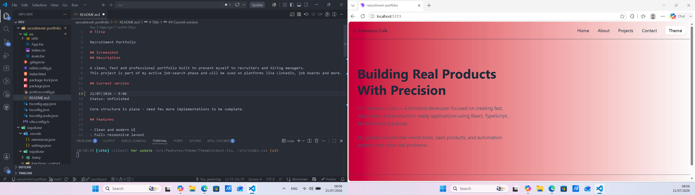

# Title

Recruitment Portfolio

## Screenshot

## Description

A clean, fast and professional portfolio built to present myself to recruiters and hiring managers.
This project is part of my active job-search phase and will be used on platforms like LinkedIn, job boards.

## Current version

21/07/2026 - 9:06
Status: Unfinished

## Features

- Clean and modern UI
- Fully responsive layout
- Dedicated pages: Home, About, Projects, Contact
- Custom contact form powered by Supabase Edge Functions + Resend
- Real backend email delivery
- Smooth navigation and simple structure

## Tech stack

- React Vite
- Typescript
- Tailwindcss
- Supabase edge functions
- Resend

## Bugs (on current commit)

- Contact form success message sometimes delays due to first‑time Resend warm‑up
- Some sections still use placeholder text
- Homepage hero content not finalized

## Improvements

- Add animations to hero + skills section
- Add project case‑study pages
- Add rate‑limiting + spam protection to contact form
- Add loading states and UI polish
- Add more projects once completed

## Changelog

### 21/07/2026
- Fixed ThemeContext default export issue causing app crash
- Added proper TypeScript types to ThemeContext
- Updated Layout, Navbar and ThemeToggle to safely read theme context
- Fixed all implicit "any" TypeScript errors across components
- Added correct types for ContactForm, ProjectCard, SkillBadge and validation functions
- Updated sendMessage.ts with proper form typing
- Ensured Vercel build passes TypeScript checks
- Connected frontend contact form to Supabase Edge Function + Resend
- Added real email delivery and validation flow

## Author

Yoichi dev